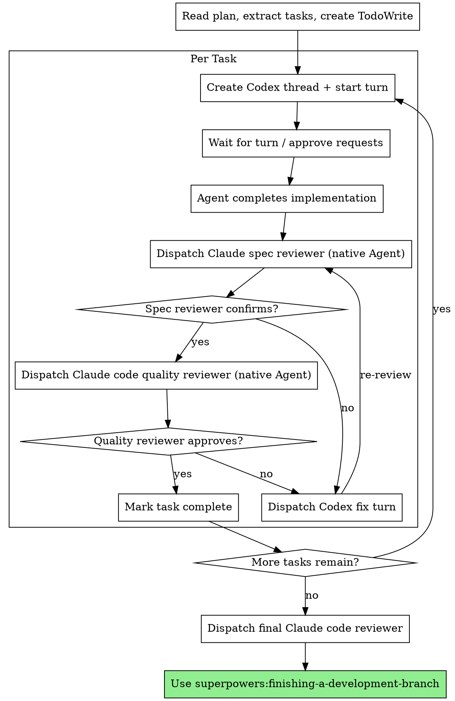

# Subagent-Driven Development (Codex Backend)

Execute plan by dispatching coding tasks to Codex agents via MCP, with two-stage review after each: spec compliance review first, then code quality review. Reviews stay as Claude native agents.

**Why this pattern:** Claude Code acts as CTO -- it plans, researches, and reviews. Codex agents handle the coding and testing. Each coding task gets its own thread, allowing parallel execution.

**Core principle:** Fresh Codex thread per task + Claude-native two-stage review (spec then quality) = high quality, fast iteration

## When to Use

- Have an implementation plan with independent tasks
- Tasks are mostly independent (can run in parallel)
- Want to stay in this session while agents code in the background

## The Process



## Dispatching Implementation (Codex)

For each coding task, dispatch via Codex MCP tools in sequence:

**Step 1: Create thread**
```
mcp__codex-worker__codex-thread-start(
  model: "gpt-5.4",
  developer_instructions: "Follow TDD. Commit after each feature. Report DONE/BLOCKED/NEEDS_CONTEXT when finished."
)
```

**Step 2: Start turn with task prompt**
```
mcp__codex-worker__codex-turn-start(
  thread_id: "<from step 1>",
  user_input: <filled implementer-prompt.md template>
)
```

**Step 3: Wait and approve requests**
```
mcp__codex-worker__codex-wait(operation_id: "<from step 2>")
```
If the agent needs approval (commands, file changes):
```
mcp__codex-worker__codex-request-list()
mcp__codex-worker__codex-request-respond(request_id: "<id>", decision: "accept")
mcp__codex-worker__codex-wait(operation_id: "<same>")  // resume waiting
```

**Step 4: Read results**
```
mcp__codex-worker__codex-thread-read(thread_id: "<id>", include_turns: true)
```

**Parallel execution:** Launch multiple threads simultaneously. Each thread is independent. Start turns on all threads, then wait/approve in round-robin.

```
codex-thread-start(task1) --\
codex-thread-start(task2) ---+-- all created concurrently
codex-thread-start(task3) --/
    |
codex-turn-start on each
    |
codex-wait / codex-request-respond loop
    |
Claude reviews all results
```

## Dispatching Reviews (Claude Native)

Reviews use Claude Code's native `Agent` tool -- NOT Codex. Review is a judgment task that benefits from Claude's full reasoning.

**Spec compliance review:**
```
Agent(
  subagent_type: "superpowers:code-reviewer",
  prompt: <filled spec-reviewer-prompt.md>
)
```

**Code quality review:**
```
Agent(
  subagent_type: "superpowers:code-reviewer",
  prompt: <filled code-quality-reviewer-prompt.md>
)
```

## Model Selection

| Role | Model | Why |
|------|-------|-----|
| **Implementer** (Codex) | `gpt-5.4` | Default. High reasoning effort enabled server-side |
| **Spec reviewer** (Claude) | Native agent | Full context, judgment task |
| **Code quality reviewer** (Claude) | Native agent | Same |
| **Final reviewer** (Claude) | Native agent | Highest stakes |

If user requests a different model, pass it in the `model` parameter of `codex-thread-start`. If an agent fails, escalate model or CTO takes over.

## Handling Agent Status

**Turn completes normally:** Read thread, proceed to spec compliance review.

**Agent needs approval:** `codex-request-list` shows pending requests. Approve with `codex-request-respond`. Resume waiting.

**Turn fails:** Read thread for error details. Re-dispatch with corrected instructions. If 3+ failures, CTO handles directly.

## Prompt Templates

- `./implementer-prompt.md` -- Codex implementer agent prompt
- `./spec-reviewer-prompt.md` -- Claude spec compliance reviewer
- `./code-quality-reviewer-prompt.md` -- Claude code quality reviewer

## Red Flags

**Never:**
- Skip reviews (spec compliance OR code quality)
- Proceed with unfixed issues
- Dispatch reviews to Codex (reviews stay Claude-native)
- Start implementation on main/master without explicit user consent
- Ignore pending requests (agent is stuck waiting)

**Always:**
- Approve pending requests promptly
- Provide full task text in the prompt
- Monitor threads via `codex-thread-read` or `codex-wait`
- Use `codex-turn-steer` to redirect if agent goes off track

## Integration

**Required workflow skills:**
- **superpowers:writing-plans** -- Creates the plan this skill executes
- **superpowers:requesting-code-review** -- Code review template
- **superpowers:finishing-a-development-branch** -- Complete development after all tasks
- **superpowers:test-driven-development** -- Injected into implementer prompts
